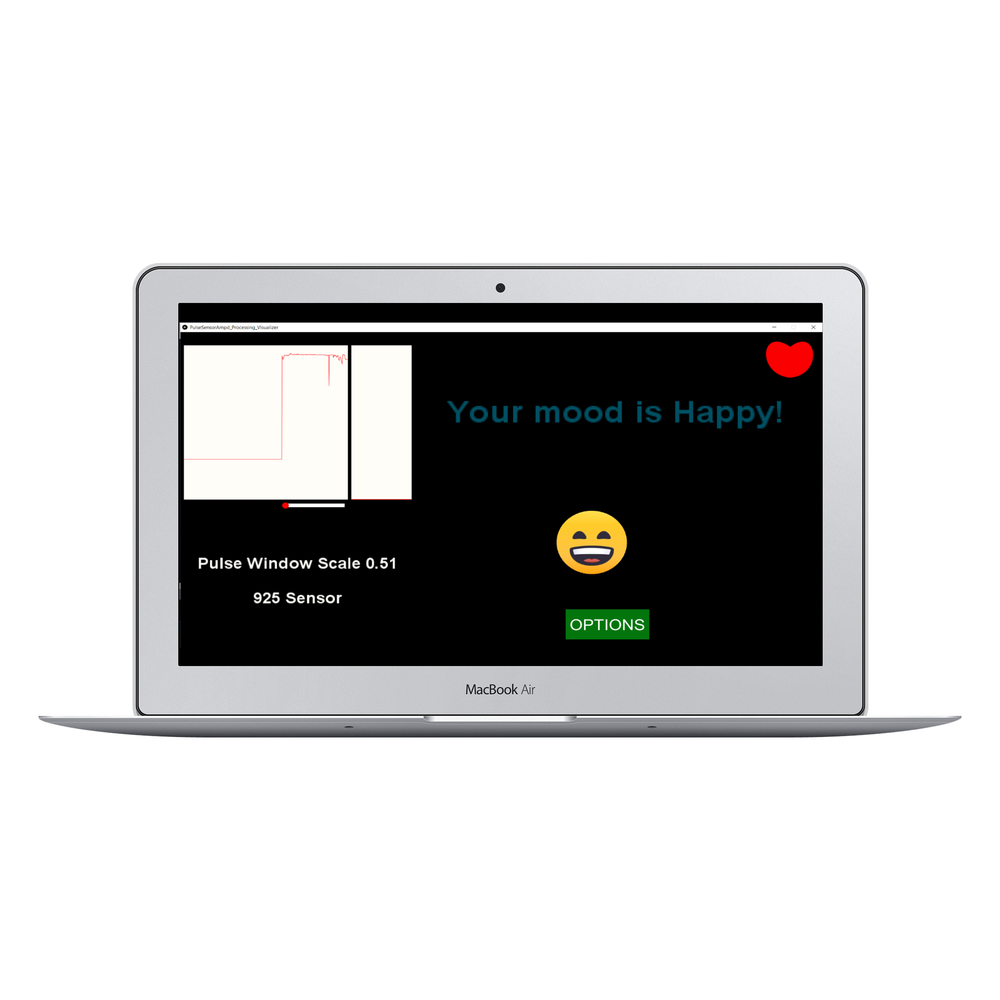

# MOOD BEATZ
Displaying the mood of a character. Colors of the face, facial expressions will be changed   according to the heartbeat range. It has four main options as 1.Games 2. Music library 3. Doodle drawing 4.Videos (Relaxing) and the  user can select  preferences according to the mood. The Processing IDE and Arduino IDE mainly used in this project.

## SCREENS

